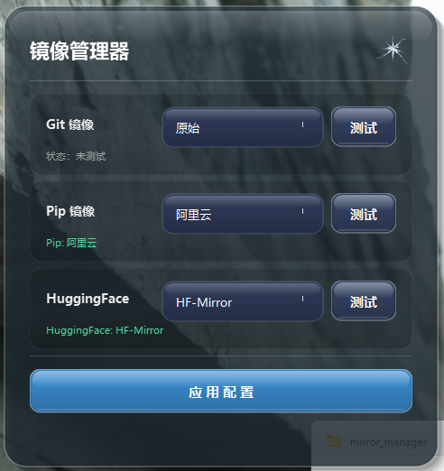

# Windows 镜像管理器

一键切换 Git、Pip、HuggingFace 镜像源的 Windows 桌面工具。


## 功能特性

- 🎨 **玻璃拟态UI** - 现代化透明玻璃效果界面
- ⚡ **即时生效** - 配置立即生效，无需重启终端
- 💾 **持久化存储** - 重启后配置仍然有效
- 🔧 **智能清理** - 自动清理所有旧配置位置
- 🔍 **连接测试** - 多线程测试镜像延迟
- 📦 **外部配置** - JSON 配置文件自定义镜像源

## 截图



## 下载安装

### 方式一：直接下载

1. 前往 [Releases](../../releases) 页面下载最新版本
2. 解压后将 `mirrors.json` 放在 `.exe` 同目录下
3. 双击运行

### 方式二：从源码构建

```bash
# 克隆仓库
git clone https://github.com/your-username/windows-mirror-manager.git
cd windows-mirror-manager

# 安装依赖
pip install PyQt6

# 打包
pyinstaller --onefile --windowed --icon=mirror_manager/icon.ico --name "镜像管理器" mirror_manager/app_glass.py
```

## 使用方法

1. **选择镜像**：在下拉框中选择要使用的镜像源
2. **测试连接**：点击"测试"按钮查看延迟
3. **应用配置**：点击"应用配置"按钮保存设置

## 支持的镜像源

### Git (5个)
| 名称 | 地址 |
|------|------|
| 原始 | 无代理 |
| 阿里云 | mirrors.aliyun.com |
| 腾讯云 | mirrors.cloud.tencent.com |
| 华为云 | repo.huaweicloud.com |
| 中科大 | mirrors.ustc.edu.cn |

### Pip (8个)
| 名称 | 地址 |
|------|------|
| 原始 | pypi.org |
| 阿里云 | mirrors.aliyun.com |
| 清华大学 | pypi.tuna.tsinghua.edu.cn |
| 腾讯云 | mirrors.cloud.tencent.com |
| 华为云 | repo.huaweicloud.com |
| 中科大 | pypi.mirrors.ustc.edu.cn |
| 豆瓣 | pypi.douban.com |
| 北外 | mirrors.bfsu.edu.cn |

### HuggingFace (2个)
| 名称 | 地址 |
|------|------|
| 原始 | huggingface.co |
| HF-Mirror | hf-mirror.com |

## 配置策略

本工具使用**环境变量优先**策略：

| 配置项 | 方式 | 优先级 |
|--------|------|--------|
| Pip | `PIP_INDEX_URL` 环境变量 | 最高 |
| HuggingFace | `HF_ENDPOINT` 环境变量 | 最高 |
| Git | `~/.gitconfig` | 用户级 |

## 配置文件格式

`mirrors.json` 示例：

```json
{
    "git": [
        {"name": "原始", "url": ""},
        {"name": "阿里云", "url": "https://mirrors.aliyun.com/git/"}
    ],
    "pip": [
        {"name": "原始", "url": "https://pypi.org/simple"},
        {"name": "清华", "url": "https://pypi.tuna.tsinghua.edu.cn/simple"}
    ],
    "hf": [
        {"name": "原始", "url": "https://huggingface.co"},
        {"name": "HF-Mirror", "url": "https://hf-mirror.com"}
    ]
}
```

## 系统要求

- Windows 10/11
- 无需安装 Python（已打包为独立可执行文件）

## 技术栈

- Python 3.13
- PyQt6
- PyInstaller

## 更新日志

### v1.2.0 (2026-02-27)
- 全新玻璃拟态UI设计
- Pip/HF 配置改用环境变量（优先级最高）
- 智能清理所有旧配置位置
- 新增多所高校镜像源

查看完整更新日志：[CHANGELOG.md](CHANGELOG.md)

## 许可证

[MIT License](LICENSE)

## 贡献

欢迎提交 Issue 和 Pull Request！
